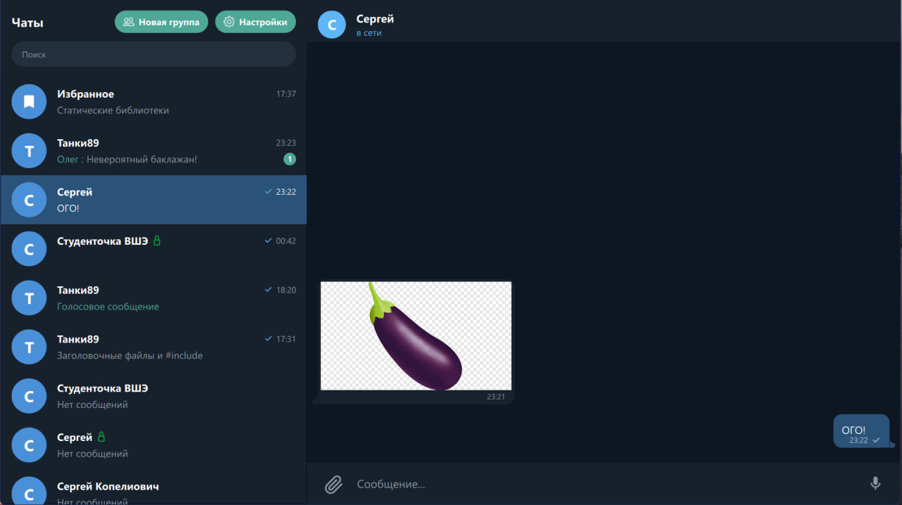
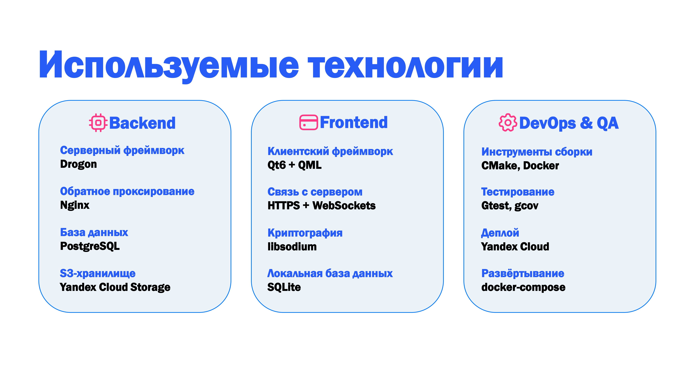
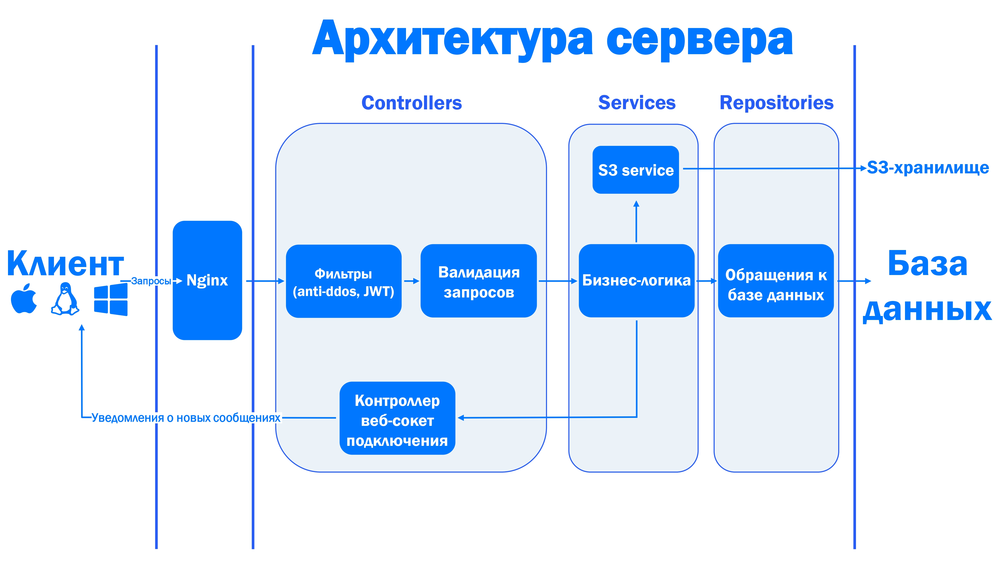
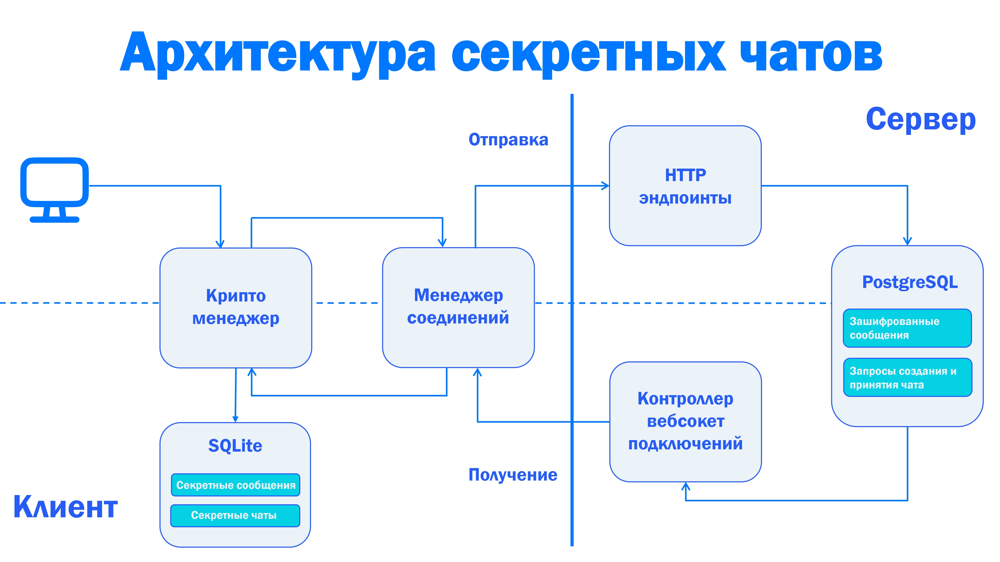

[](https://t.me/+V9sf31BJYg5kNzAy)


# Алёша (ALYOsha) — Современный мессенджер на C++

Разрабатывается студентами НИУ ВШЭ Санкт-Петербург как учебная работа по курсу проектов C++. Наша цель — создать производительный<!--ха -->, масштабируемый<!--ха-ха --> и безопасный<!--ахахахахахах --> мессенджер с использованием современных архитектурных паттернов.


### Текущие возможности:
*   **Групповые и личные чаты**
*   **Секретные чаты со сквозным шифрованием**
*   **Избранное**
*   **Отправка и просмотр вложений в чате (фото, видео, документы и голосовые сообщения)**
*   **Кроссплатформенный клиент**
*   **Кастомизация интерфейса**
*   **Кеш и оффлайн-режим клиента**

### Демовидео:
[](https://disk.360.yandex.ru/i/v893zLV-aV8d_g)


## Технологический стек

*   **Язык:** C++20 (корутины).
*   **Сервер:** [Drogon Framework](https://drogon.org/) — один из самых быстрых асинхронных веб-фреймворков.
*   **База данных:** PostgreSQL + SQLite (клиент)
*   **ORM:** Drogon ORM для интеграции с БД.
*   **Клиент:** Qt / QML для создания кроссплатформенного и плавного интерфейса.
*   **DevOps:** Docker & Docker Compose для изоляции зависимостей и CI/CD через GitHub Actions.
*   **Тестирование:** [Google Test](https://github.com/google/googletest)
*   **Криптография:** Libsodium




## Архитектура системы

Стандартная многослойная архитектура для обеспечения тестируемости и гибкости разработки:

1.  **Repository Layer:** Прямая работа с базой данных (CRUD-операции через ORM).
2.  **Service Layer:** Бизнес-логика приложения. Здесь принимаются решения, обрабатываются данные и управляются состояния.
3.  **Controller Layer:** Обработка входящих HTTP/WebSocket запросов от клиента, валидация входных данных.
4.  **Client (QML):** Представление данных и взаимодействие с пользователем.



#




## Быстрый старт

### Предварительные требования
*   Установленный **Docker** и **Docker Compose**.
*   Компилятор с поддержкой **C++20** (GCC 11+ или Clang 13+).
*   **Make**-утилита.

### Запуск сервера и БД
Для автоматической сборки Docker-образов и поднятия инфраструктуры выполните:
```bash
make run_server
```

### Сборка клиента
Клиент собранный локально запускается только при наличии нужных динамических библиотек QT. Ubuntu 22.04 нужным набором не обладает, на 24.04 все точно запускается.
Для компиляции клиентского приложения:
```bash
make build_client
```


### Troubleshooting
После обновления клиента может понадобится очистить кеш. Для этого удалите следующие папки:

* Windows: `%appdata\local\AlyoshaTeam\Alyosha`. `AppData\Roaming\AlyoshaTeam\Alyosha`
* Linux: `~/.cache/AlyoshaTeam/Alyosha`, `~/.local/share/AlyoshaTeam/Alyosha`
* MacOS: `~/Library/Caches/AlyoshaTeam/Alyosha`. `~/Library/Application Support/AlyoshaTeam/Alyosha`, `/Library/Application Support/AlyoshaTeam/Alyosha`


## Структура проекта

*   `server/` — Исходный код бэкенда (Drogon, Repository, Services).
*   `client/` — Код клиентского приложения на QML/Qt.
*   `common/` — Общие структуры данных и утилиты, используемые и сервером, и клиентом.
*   `docs/` — Проектная документация и диаграммы.

## Авторы

<a href="https://github.com/VaniusK/Messenger-ALYOsha/graphs/contributors">
  
</a>

### Ментор, сенсей, вдохновитель проекта — [Сергей Дунаев](https://github.com/swerg110)

### [Подробнее про проект](https://disk.360.yandex.ru/i/7xGxOUKU24L6aw)

